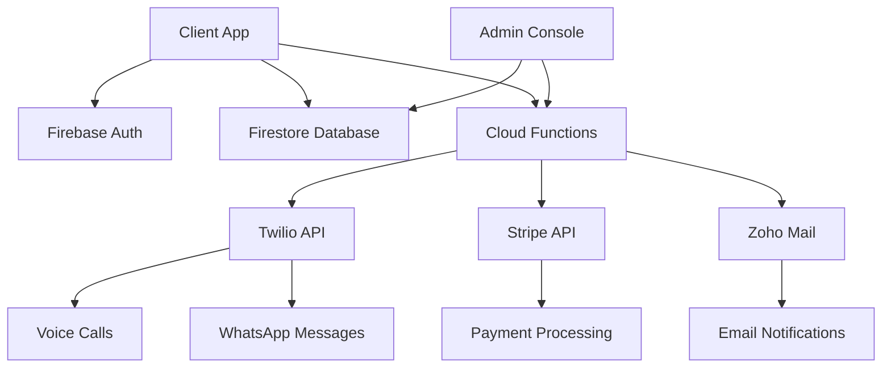

# 🌍 SOS Expat – International Assistance Platform

> **Connecting expatriates, lawyers, and clients worldwide for remote legal, administrative, and human assistance through secure calls.**

[](https://reactjs.org/)
[](https://www.typescriptlang.org/)
[](https://firebase.google.com/)
[](https://tailwindcss.com/)

---

## ✨ Key Features

### 🔐 **Secure Authentication**
- Role-based access control (Client / Lawyer / Expatriate)
- Firebase Authentication with custom claims
- Multi-language support

### 📞 **Call System**
- Secure Twilio-powered voice calls
- WhatsApp integration for messaging
- Real-time call status tracking
- Automatic call recording and logging

### 💳 **Payment Processing**
- Stripe integration for secure payments
- Deferred billing after successful calls
- Automated invoice generation
- Multi-currency support

### 🔔 **Smart Notifications**
- Push notifications
- Email alerts via Zoho Mail
- WhatsApp messaging
- SMS notifications

### 🎯 **Intelligent Matching**
- Language-based provider matching
- Geographic preference settings
- Service type filtering
- Availability-based scheduling

### 🛠 **Admin Console**
- Comprehensive dashboard
- User management
- Call analytics
- Payment monitoring
- System configuration

---

## 🚀 Tech Stack

| Category | Technology |
|----------|------------|
| **Frontend** | React 18+ • TypeScript • Vite • Tailwind CSS |
| **Backend** | Firebase Functions • Node.js • Express |
| **Database** | Firestore • Real-time listeners |
| **Authentication** | Firebase Auth • Custom claims |
| **Payments** | Stripe • Webhooks • Payment Intents |
| **Communications** | Twilio • WhatsApp API • Zoho Mail |
| **Deployment** | Firebase Hosting • Cloud Functions |
| **Monitoring** | Firebase Analytics • Custom logging |

---

## 🏗 Architecture



---

## 🚀 Quick Start

### Prerequisites
- Node.js 18+
- Firebase CLI
- Twilio Account
- Stripe Account

### Installation

1. **Clone the repository**
   ```bash
   git clone <repository-url>
   cd sos-expat
   ```

2. **Install dependencies**
   ```bash
   npm install
   cd firebase/functions && npm install
   ```

3. **Configure environment**
   ```bash
   cp .env.example .env.development
   # Edit .env.development with your credentials
   ```

4. **Deploy Firebase Functions**
   ```bash
   firebase deploy --only functions
   ```

5. **Start development server**
   ```bash
   npm run dev
   ```

---

## 📱 Features Overview

### For Clients
- 🔍 **Find Help**: Search for lawyers and expats by language and location
- 📞 **Book Calls**: Schedule secure voice consultations
- 💬 **Chat**: WhatsApp messaging with providers
- 📊 **Track History**: View past calls and payments

### For Providers (Lawyers/Expats)
- 👤 **Create Profile**: Set up professional profiles with specializations
- 📅 **Manage Availability**: Control when you're available for calls
- 💰 **Earn Money**: Get paid automatically after successful calls
- 📈 **Analytics**: Track your performance and earnings

### For Administrators
- 🎛 **Dashboard**: Comprehensive overview of platform activity
- 👥 **User Management**: Approve providers and manage users
- 💳 **Payment Monitoring**: Track all transactions and disputes
- 📊 **Analytics**: Detailed reports on usage and revenue

---

## 🔧 Configuration

### Environment Variables
```bash
# Firebase
FIREBASE_PROJECT_ID=your-project-id
FIREBASE_API_KEY=your-api-key

# Twilio
TWILIO_ACCOUNT_SID=your-account-sid
TWILIO_AUTH_TOKEN=your-auth-token
TWILIO_PHONE_NUMBER=your-phone-number

# Stripe
STRIPE_SECRET_KEY=your-stripe-secret
STRIPE_WEBHOOK_SECRET=your-webhook-secret

# Email
ZOHO_EMAIL=your-email@domain.com
ZOHO_PASSWORD=your-app-password
```

### Firebase Security Rules
The project includes comprehensive Firestore security rules for:
- User authentication and authorization
- Payment data protection
- Call session security
- Admin-only operations

---


